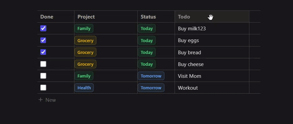

# notion-htmx

A tutorial that builds a feature rich Notion style data table. 

Tech Stack:
- HTMX
- Bun
- ElysiaJS
- UnoCSS
- Tailwind
- Hyperscript

This repo is identical to the code developed in the tutorial. 

This project was highly influence by Ethan Niser [the-beth-stack](https://github.com/ethanniser/the-beth-stack).

## Watch Tutorial on YouTube

## To run locally:
1. bun install
2. bun dev
